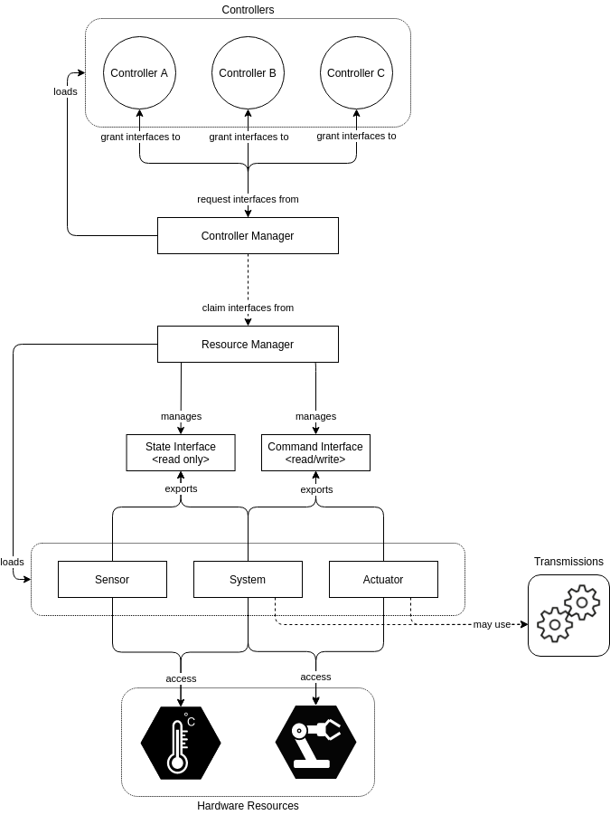

# ROS2 Control

## Overview
ROS2 Control is a set of packages that incldue controller interfaces, controller managers, transmissions, and hardware interfaces. Overal, the goal of the ROS2 Control framework is to simplify integrating new hardware. A high level diagram of the architecture is shown below. 

### Controller Manager
The controller manager (CM) connects the controllers and the hardware-abstraction sides of the control framework. The CM manages controllers (loads, activates, etc.) controllers and interfaces they require. Through the Resource Manager it has access to the hardware components and its interfaces. The CM then matches the required and provided interfaces, granting controllers access to hardware.

### Resource Manager
The resource manager (RM) abstracts physical hardware and its drivers (called hardware components). The RM loads the hardare components using the *pluginlib* library and manages their lifecycle. This abstraction provided by the RM allows the reuse of hardware components.

### Controllers
The controllers in the ROS2 Control framework are what is built on top of control theory. They compare reference values with measured output, and use this to command the systems input. While there are many existing controllers (diff-drive, Ackermann Steering, joint-trajectory interpolation, etc.), you can also write your own custom controllers by inheriting from the ControllerInterface class. These controllers are exported as plugins using the *pluginlib* library. Note that these controllers are still relatively low-level, typically requiring global planners to generate waypoints, which ros2_control then tracks.

Note that these controllers can be configured, and often command more than one joint/motor at a time, for example you could have a controller that generates min-jerk trajectories for a manipulator. The output of these controllers can be configured as well, and needs to match the expected input of the hardware components.

#### Joint State Broadcaster
Many systems rely on knowing accurate joint information. ROS2 control allows for the accurate fetching and publishing on the *\joint_states* topic using the *joint_state_broadcaster* controller. This reports back position, velocity, and effort data (depending on what state information the joint provides). For the purpose of visualization and updating frames (i.e. to make sure *robot_state_publisher* functions correctly), it is required that position information is published for revolute and prismatic joints. For continuous joints (i.e. wheels), it is optional, but required if you want to see the wheels spin in your visualization. 

### User Interfaces
Users interace with the ROS2 Control framework using the CM services.

### Hardware Components
The hardware components realize communication to the physical hardware, and therefore abstract away the complexities of interfacing with actual hardware. Again, these components are exported as plugins using the *pluginlib* library, and the plugins are managed by the RM. For many exisiting pieces of hardware, plugins exist that can be used. 

The hardware component is only responsible for interfacing with the hardware, and then the hardwares firmware is responsible for executing commands. For example, you could have a hardware component that sends commands to an arduino, which then commands a motor.

## Using ROS2 Control
To begin, a controllers.yaml file is used. This file specifies the CM loop speed, and the high-level controller plugins to be used. You can then configure these plugins, for example specifying which joints are used by which controller. Note that there is an existing suite of already registered plugins, but if you want to use your own controller, you must register it.

To connect the URDF to this configuration, you need to use the *<ros2_control>* tag inside your URDF file. To begin, inside the tag you define the hardware component plugin. Then, for each joint that uses that plugin you define what data can be read and written to it. Repeat this for each hardware component type. The overall idea is that on the URDF side you specify the hardware components and joint properties, and on the yaml side you specify the controllers and what joints they are paired with. Note that you can also just define sensors, in which case you use the sensors type. This is typically only used when said sensor is part of the real time control loop.

To start everything, inside a launch file you spin up a robot state publisher to make ROS2 aware of the hardware components, a ros2 control node, which acts as the controller manager, and then use *spawn* nodes to bring up your controllers. 

## Using ROS2 Control in Gazebo
The first step is to replace the normal hardware component plugin with the gazebo ros2 control plugin, which allows the gazebo simulation to standin for the actual hardware. Next, you need to ensure that Gazebo parses your ROS2 control configuration. This is done by adding a gazebo ros2 control plugin inside a *<gazebo>* tag. Note that when Gazebo parses the plugin block, it initializes and spins up the CM internally. Therefore, when using Gazebo you should **not** manually split up the ros2 control node.